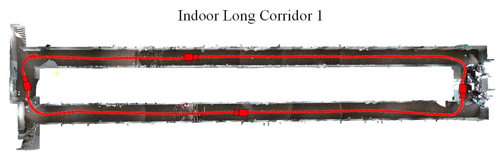
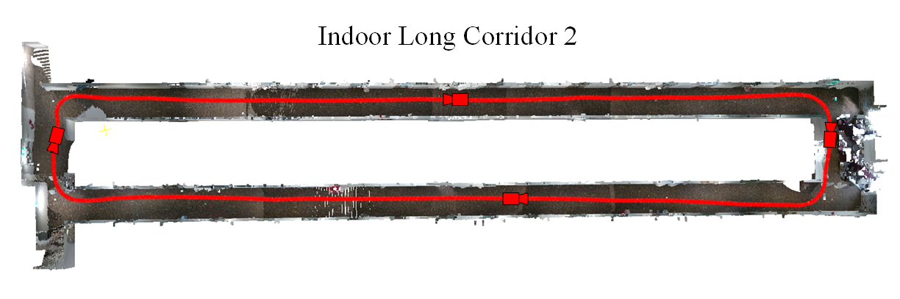
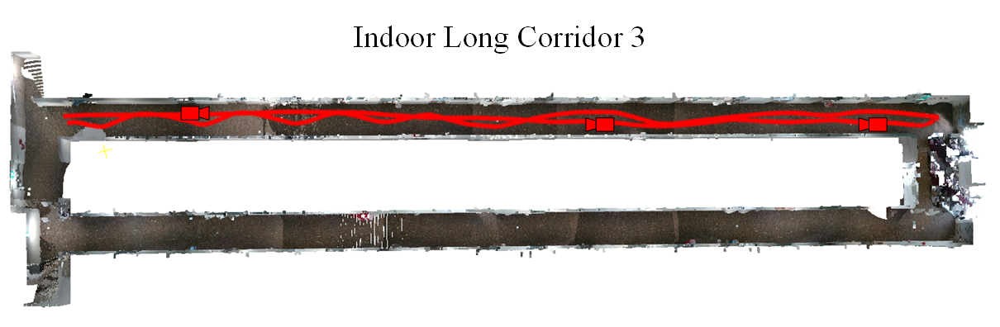
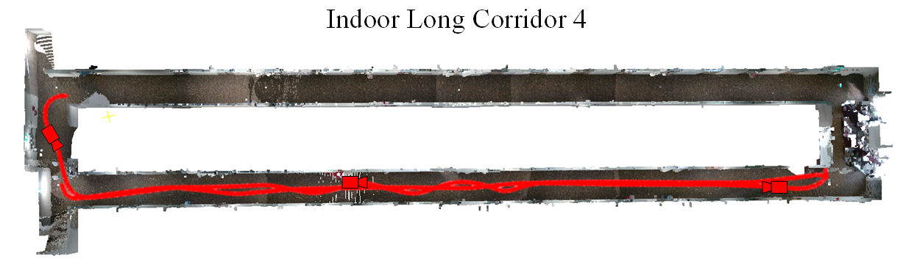
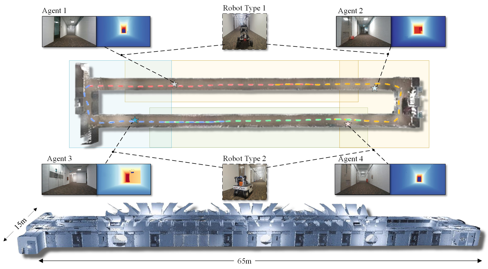

# Download

Users are strongly recommended to read through the [User Manual](UserManual). It will help clarify some technical details that can help avoid unnecessary errors when dealing with multi-modal data.

## Calibration

The calibrated parameters for the sensorsuites are provided in the following yaml files:

[Robot Type 1]() (for **robot Type1* sequences)

[Robot Type 2]() (for **robot Type1* sequences)

## Single-Agent Scenes
The sequences are captured as rosbags, which are then compressed with bz2 method. User can uncompress the rosbags for less CPU usage at the cost of 3x memory storage. For user convenience, we extracted data from the rosbag, primarily providing color and depth images, lidar points as PCD files, and IMU.

<table border="1" class="tg" style="undefined;table-layout: fixed;text-align:center">
  <colgroup>
		<col style="width: 8px">
		<col style="width: 150px">
		<col style="width: 420px">
		<col style="width: 150px">
		<col style="width: 150px">
    <col style="width: 150px">
		<col style="width: 100px">
		<col style="width: 100px">
	</colgroup>
	<thead>
    <tr style="text-align: right;">
      <th class="tg-mypc">#</th>
      <th class="tg-mypc">SeqID</th>
      <th class="tg-mypc">Ground Truth</th>
      <th class="tg-mypc">Color Image</th>
      <th class="tg-mypc">Depth Sensor Image</th>
      <th class="tg-mypc">Depth Project Image</th>
      <th class="tg-mypc">Livox</th>
      <th class="tg-mypc">Imu</th>
    </tr>
  </thead>
  <tbody>
    <tr>
      <th class="tg-mypc">1</th>
      <td><a href="https://sjtueducn-my.sharepoint.com/:f:/g/personal/dengtianchen_sjtu_edu_cn/EuMZ43Kj7AhAnTPkA-Rt7hgBbFrLok3j1Vmrv3nU0UJW8Q?e=2QFAR2" rel="noopener noreferrer" target="_blank">indoor_long_corridor01 </a> </td>
      <td></td>
      <td><a href="https://sjtueducn-my.sharepoint.com/:f:/g/personal/dengtianchen_sjtu_edu_cn/EgziMmaqQ29Cn4-fzhkCxxoBM0E4NFg_cAb67eKKSsGBPA?e=h2IlaD" rel="noopener noreferrer" target="_blank">Color</a></td>
      <td><a href="https://sjtueducn-my.sharepoint.com/:f:/g/personal/dengtianchen_sjtu_edu_cn/ElgajWoQqwlIu2MSaVz6NcUBjvHsdoBiff0K2H6kSlWuOQ?e=asZtGm" rel="noopener noreferrer" target="_blank">Depth Sensor</a></td>
      <td><a href="https://sjtueducn-my.sharepoint.com/:f:/g/personal/dengtianchen_sjtu_edu_cn/EtH_-THjJMlFpGuEzvZASogB4f154yKqEwnTXoNP0jeu-A?e=L4ZKrL" rel="noopener noreferrer" target="_blank">Depth Proj</a></td>
      <td><a href="https://sjtueducn-my.sharepoint.com/:f:/g/personal/dengtianchen_sjtu_edu_cn/Eo8jxoabtUZDhBUZD_o_NLUBsfIF45vnWyiX_OWQntrCXQ?e=sUgYNJ" rel="noopener noreferrer" target="_blank">Lidar</a></td>
      <td><a href="https://sjtueducn-my.sharepoint.com/:f:/g/personal/dengtianchen_sjtu_edu_cn/EsoU7emdPQZFurnA-YbfGvwBfHCtUKMLkaIiolE4DonIQQ?e=pGqqO1" rel="noopener noreferrer" target="_blank">Imu</a></td>
    </tr>
    <tr>
      <th class="tg-mypc">2</th>
      <td><a href="" rel="noopener noreferrer" target="_blank">indoor_long_corridor02 </a> </td>
      <td></td>
      <td><a href="" rel="noopener noreferrer" target="_blank">Color</a></td>
      <td><a href="" rel="noopener noreferrer" target="_blank">Depth Sensor</a></td>
      <td><a href="" rel="noopener noreferrer" target="_blank">Depth Proj</a></td>
      <td><a href="" rel="noopener noreferrer" target="_blank">Lidar</a></td>
      <td><a href="" rel="noopener noreferrer" target="_blank">Imu</a></td>
    </tr>
    <tr>
      <th class="tg-mypc">3</th>
      <td><a href="" rel="noopener noreferrer" target="_blank">indoor_long_corridor03 </a> </td>
      <td></td>
      <td><a href="" rel="noopener noreferrer" target="_blank">Color</a></td>
      <td><a href="" rel="noopener noreferrer" target="_blank">Depth Sensor</a></td>
      <td><a href="" rel="noopener noreferrer" target="_blank">Depth Proj</a></td>
      <td><a href="" rel="noopener noreferrer" target="_blank">Lidar</a></td>
      <td><a href="" rel="noopener noreferrer" target="_blank">Imu</a></td>
    </tr>
    <tr>
      <th class="tg-mypc">4</th>
      <td><a href="" rel="noopener noreferrer" target="_blank">indoor_long_corridor04 </a> </td>
      <td></td>
      <td><a href="" rel="noopener noreferrer" target="_blank">Color</a></td>
      <td><a href="" rel="noopener noreferrer" target="_blank">Depth Sensor</a></td>
      <td><a href="" rel="noopener noreferrer" target="_blank">Depth Proj</a></td>
      <td><a href="" rel="noopener noreferrer" target="_blank">Lidar</a></td>
      <td><a href="" rel="noopener noreferrer" target="_blank">Imu</a></td>
    </tr>
  </tbody>
</table>

## Multi-Agent Scenes
The multi-agent scenario consists of four trajectories within the long_corridor scene, each containing segments with inter-agent loop closures.

<table border="2" class="tg" style="undefined;table-layout: fixed;text-align:center">
  <colgroup>
    <col style="width: 150px">
    <col style="width: 420px">
    <col style="width: 150px">
    <col style="width: 150px">
    <col style="width: 150px">
    <col style="width: 120px">
  </colgroup>
  <thead>
    <tr style="text-align: right;">
      <th class="tg-mypc">SeqID</th>
      <th class="tg-mypc">Ground Truth</th>
      <th class="tg-mypc">Color Image</th>
      <th class="tg-mypc">Depth Sensor Image</th>
      <th class="tg-mypc">Depth Proj. Image</th>
      <th class="tg-mypc">Livox</th>
      <th class="tg-mypc">Imu</th>
    </tr>
  </thead>
  <tbody>
    <tr>
      <td><a href="https://1drv.ms/f/c/7483a674c95c7aef/EgdkgA-4MeZJiNwgxZ0D6EcBCaFv0D43rVqKSEUOIIN1wQ?e=ywKa2Y" rel="noopener noreferrer" target="_blank">Multi-agent_long_corridor </a> </td>
      <td></td>
      <td><a href="https://1drv.ms/u/c/7483a674c95c7aef/EecV8dWj9JBIte48IF4aTnYBLDtR_0WutE6-hihn3WGO5Q?e=NzeWb0" rel="noopener noreferrer" target="_blank">Color1</a> <a href="https://1drv.ms/u/c/7483a674c95c7aef/EcWYx1g_gCZIqhSE-v9DMvgBigkbCkIimIuU0k61Qh1Rbg?e=x7mPQm" rel="noopener noreferrer" target="_blank">Color2</a> <a href="https://1drv.ms/u/c/7483a674c95c7aef/EeQjwZ2ey5BOlIGlthXQBVkBWmGiJrd0PU3AAAhxNa96nQ?e=wSzjsF" rel="noopener noreferrer" target="_blank">Color3</a> <a href="https://1drv.ms/u/c/7483a674c95c7aef/EcL8aimu1ctNg3EZAYTpsaoBDDS9tA7t3P-m7e1xjP_0NQ?e=0trOgp" rel="noopener noreferrer" target="_blank">Color4</a> </td>
      <td><a href="https://1drv.ms/u/c/7483a674c95c7aef/EYfmx1inZDJKqcCalPXhqfUBGt-Dq_qcHVF2o-D1fnY7Ug?e=uACaYC" rel="noopener noreferrer" target="_blank">Depth1</a> <a href="https://1drv.ms/u/c/7483a674c95c7aef/EVsOoiRACWFOhpFToMatUIYB9vBOLvJcDJ8eFpFH-CJxgw?e=rgAjHx" rel="noopener noreferrer" target="_blank">Depth2</a> <a href="https://1drv.ms/u/c/7483a674c95c7aef/EVsOoiRACWFOhpFToMatUIYB9vBOLvJcDJ8eFpFH-CJxgw?e=1uy2b0" rel="noopener noreferrer" target="_blank">Depth3</a> <a href="https://1drv.ms/u/c/7483a674c95c7aef/ERSY3Wf6Q1ZFmP56rEeJQfYBKQncxBMe9u8kwzbHXi7AXQ?e=YHqPV5" rel="noopener noreferrer" target="_blank">Depth4</a> </td>
      <td><a href="https://1drv.ms/u/c/7483a674c95c7aef/ESqNDy1g34FBptaJ05sV2OgBDkjoK6ZPyW1R251mXLdfCA?e=eD4ShV" rel="noopener noreferrer" target="_blank">DepthProj1</a> <a href="https://1drv.ms/u/c/7483a674c95c7aef/Eb8CaiAf4yJHmvyb54Iw6ZkBKl2nt0Pqh9idU29WEc8Sew?e=bKlkJU" rel="noopener noreferrer" target="_blank">DepthProj2</a> <a href="https://1drv.ms/u/c/7483a674c95c7aef/EWUm0ILh8nROjk4QGcxNxM4BSEP0svsslpUvHwz66eerVQ?e=SUiAKq" rel="noopener noreferrer" target="_blank">DepthProj3</a> <a href="https://1drv.ms/u/c/7483a674c95c7aef/EQbW8S35tERDuHX6q14ZucIBMKRu_T1pY6RRD-6Lka8tZQ?e=3ysWVp" rel="noopener noreferrer" target="_blank">DepthProj4</a> </td>
      <td><a href="https://1drv.ms/u/c/7483a674c95c7aef/EbQP7YwcNNlCrAwRPU6C2dQBUFvj9kclwStUcjwQU8aYmg?e=YOakKf" rel="noopener noreferrer" target="_blank">Lidar1</a><a href="https://1drv.ms/u/c/7483a674c95c7aef/ETdSGkCJ8WNIlP-az5R3xA4B0JZc32S7Z8zM8XGgkukyKg?e=AO2JOy" rel="noopener noreferrer" target="_blank">Lidar2</a><a href="https://1drv.ms/u/c/7483a674c95c7aef/EURKVjHvzj9GlLgYFpRc_kMBYUQvm4mFVoc-o0W22WUiRQ?e=eppbIh" rel="noopener noreferrer" target="_blank">Lidar3</a> <a href="https://1drv.ms/u/c/7483a674c95c7aef/ESYXXCgmwwhHpslknCbQtq4BBmN6d37d94OhmZGUok0-Dw?e=ZlYXm4" rel="noopener noreferrer" target="_blank">Lidar4</a></td>
      <td><a href="https://1drv.ms/u/c/7483a674c95c7aef/EU-7qFyn0cREmMK9CYCwfU0B-hlO36gVHqCIuTmA3D4SaQ?e=EcKAfy" rel="noopener noreferrer" target="_blank">Imu1</a> <a href="https://1drv.ms/u/c/7483a674c95c7aef/Ee_lSJNLJq1Nmd2yNrXAOVoBu-CcRlsFHt9AkL6h2USqcg?e=kM6XTR" rel="noopener noreferrer" target="_blank">Imu2</a> <a href="https://1drv.ms/u/c/7483a674c95c7aef/Ee_lSJNLJq1Nmd2yNrXAOVoBu-CcRlsFHt9AkL6h2USqcg?e=m8XcI4" rel="noopener noreferrer" target="_blank">Imu3</a> <a href="https://1drv.ms/u/c/7483a674c95c7aef/ESQs7KSsDMFJuETA1pI4icwB4_CbbRe9cOBOkgN8fnnM3w?e=y8DzFJ" rel="noopener noreferrer" target="_blank">Imu4</a></td>
    </tr>
  </tbody>
</table>