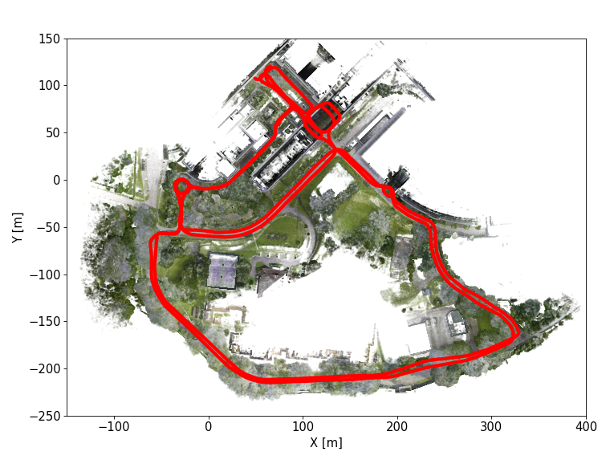
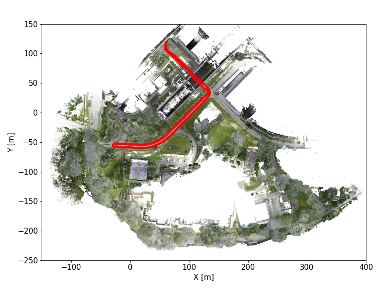

# Download

Users are strongly recommended to read through the [User Manual](UserManual). It will help clarify some technical details that can help avoid unnecessary errors when dealing with multi-modal data.

## Calibration

The calibrated parameters for the sensorsuites are provided in the following yaml files:

[Robot Type 1]() (for **robot Type1* sequences)

[Robot Type 2]() (for **robot Type1* sequences)

## Color and Depth Images
The sequences are captured as rosbags, which are then compressed with bz2 method. User can uncompress the rosbags for less CPU usage at the cost of 3x memory storage. For user convenience, we extracted data from the rosbag, primarily providing color and depth images.

<table border="1" class="tg" style="undefined;table-layout: fixed;text-align:center">
  <colgroup>
		<col style="width: 8px">
		<col style="width: 150px">
		<col style="width: 420px">
		<col style="width: 100px">
		<col style="width: 100px">
		<col style="width: 100px">
		<col style="width: 100px">
	</colgroup>
	<thead>
    <tr style="text-align: right;">
      <th class="tg-mypc">#</th>
      <th class="tg-mypc">SeqID</th>
      <th class="tg-mypc">Ground Truth</th>
      <th class="tg-mypc">Color Image</th>
      <th class="tg-mypc">Depth Image</th>
      <th class="tg-mypc">Livox</th>
      <th class="tg-mypc">Imu</th>
    </tr>
  </thead>
  <tbody>
    <tr>
      <th class="tg-mypc">0</th>
      <td><a href="" rel="noopener noreferrer" target="_blank">indoor_long_corridor01 </a> </td>
      <td></td>
      <td><a href="" rel="noopener noreferrer" target="_blank">Color</a></td>
      <td><a href="" rel="noopener noreferrer" target="_blank">Depth</a></td>
      <td><a href="" rel="noopener noreferrer" target="_blank">Lidar</a></td>
      <td><a href="" rel="noopener noreferrer" target="_blank">Imu</a></td>
    </tr>
    <tr>
      <th class="tg-mypc">1</th>
      <td><a href="" rel="noopener noreferrer" target="_blank">indoor_long_corridor02 </a> </td>
      <td></td>
      <td><a href="" rel="noopener noreferrer" target="_blank">Color</a></td>
      <td><a href="" rel="noopener noreferrer" target="_blank">Depth</a></td>
      <td><a href="" rel="noopener noreferrer" target="_blank">Lidar</a></td>
      <td><a href="" rel="noopener noreferrer" target="_blank">Imu</a></td>
    </tr>
    <tr>
      <th class="tg-mypc">2</th>
      <td><a href="" rel="noopener noreferrer" target="_blank">indoor_long_corridor03 </a>   Duration: 5m25s   Size: 20.9 GB</td>
      <td></td>
      <td><a href="" rel="noopener noreferrer" target="_blank">Color</a></td>
      <td><a href="" rel="noopener noreferrer" target="_blank">Depth</a></td>
      <td><a href="" rel="noopener noreferrer" target="_blank">Lidar</a></td>
      <td><a href="" rel="noopener noreferrer" target="_blank">Imu</a></td>
    </tr>

  </tbody>
</table>
