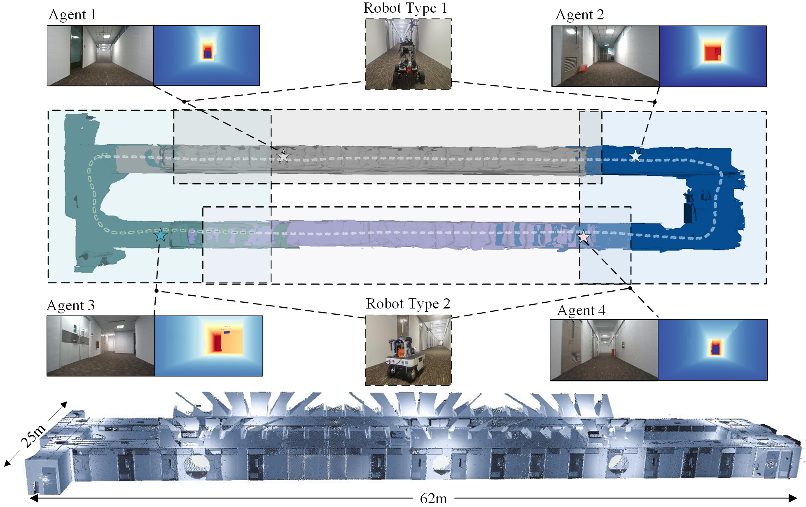

    

# [MNE-SLAM: Multi-agent Neural SLAM for Mobile Robots (Indoor Neural SLAM Dataset)](https://ins-dataset.github.io/ins.github.io/)

The dataset is collected over large-scale campus areas in the Asia and Europe at different seasons, featuring:

* A comprehensive multi-sensor suite:
  + Non-repetItive lidar
  + RGB Camera
  + Depth Camera
  + High quality IMUs
* Multi Robot Type
  

    
    
  

* High resolution large scale survey-grade prior maps
  

    
    
    
  

* Several examples on SOTA SLAM and learning methods.

# Notes:

If you have some inquiry, please raise an [issue](https://github.com/mcdviral/mcdviral.github.io/issues) on github.

# Licence
This work is licensed under a [Creative Commons Attribution-NonCommercial-ShareAlike 4.0 International License](https://creativecommons.org/licenses/by-nc-sa/4.0/) and is intended for non-commercial academic use.

# Updates

**15/11/2024**: Preliminary release.
