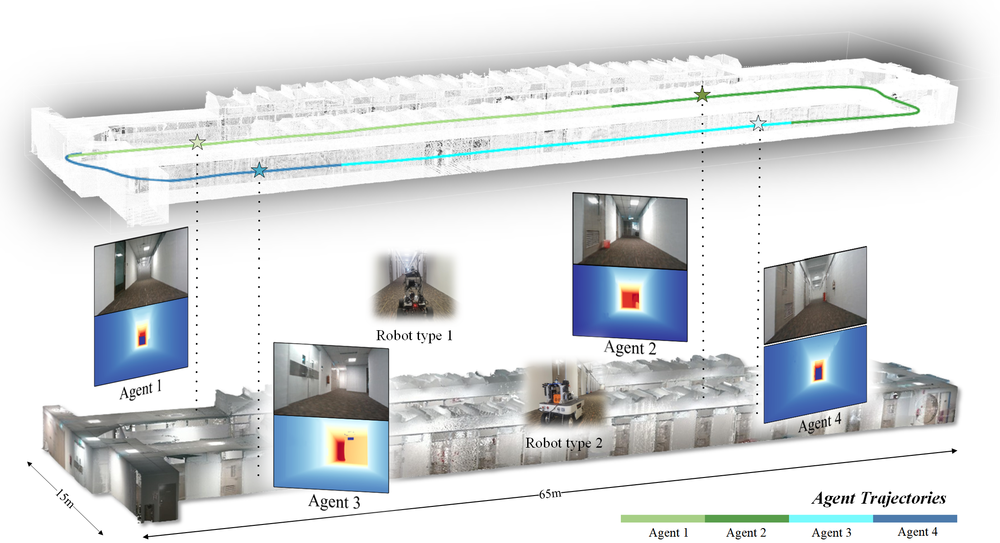
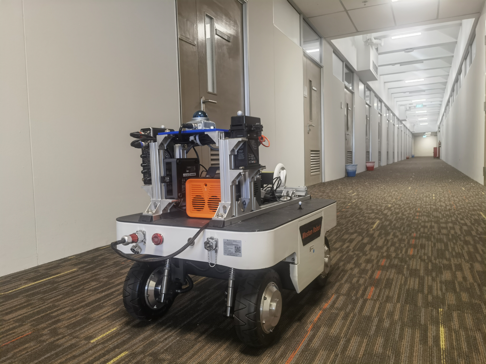
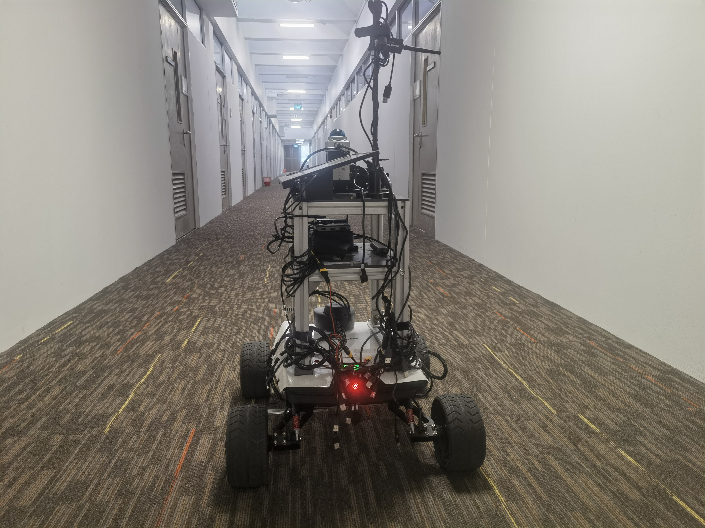
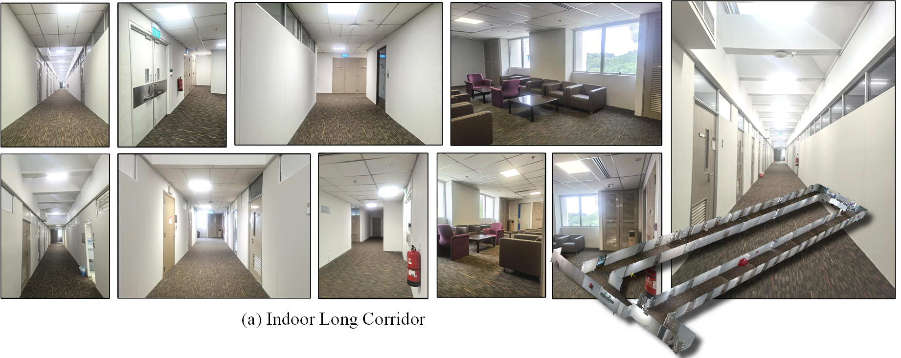

<p align="center">
    
</p>

# [MNE-SLAM: Multi-agent Neural SLAM for Mobile Robots (Indoor Neural SLAM Dataset)](https://ins-dataset.github.io/ins/)

The dataset is collected over large-scale indoor areas, featuring:

* A comprehensive multi-sensor suite:
  + Non-repetitive lidar
  + RGB Camera
  + Depth Camera
  + High quality IMUs
* Multiple Robot Types
  <p align="center">
    
    
  </p>
* High resolution large scale survey-grade prior maps
  <p align="center">
    
    
    
  </p>
* Visualization of INS dataset.
<p align="center">
    
</p>
# Notes:
Please click the [title](https://github.com/ins-dataset/ins) for the full dataset!

If you have some inquiry, please raise an [issue](https://github.com/ins-dataset/ins/issues) on github.


# Download

Users are strongly recommended to read through the [User Manual](UserManual). It will help clarify some technical details that can help avoid unnecessary errors when dealing with multi-modal data.

## Calibration

The calibrated parameters for the sensorsuites are provided in the following yaml files:

[Robot Type 1]() (for **robot Type1* sequences)

[Robot Type 2]() (for **robot Type1* sequences)

## Single-Agent Color and Depth Images
The sequences are captured as rosbags, which are then compressed with bz2 method. User can uncompress the rosbags for less CPU usage at the cost of 3x memory storage. For user convenience, we extracted data from the rosbag, primarily providing color and depth images.


<style type="text/css">
.tg  {border-collapse:collapse;border-spacing:0;}
.tg td{border-color:black;border-style:solid;border-width:1px;font-family:Arial, sans-serif;font-size:14px;
  overflow:hidden;padding:10px 5px;word-break:normal;}
.tg th{border-color:black;border-style:solid;border-width:1px;font-family:Arial, sans-serif;font-size:14px;
  font-weight:normal;overflow:hidden;padding:10px 5px;word-break:normal;}
.tg .tg-mypc{background-color:#ffffff;color:#330001;font-weight:bold;text-align:center;vertical-align:middle}
</style>
<table border="1" class="tg" style="undefined;table-layout: fixed;text-align:center">
  <colgroup>
		<col style="width: 8px">
		<col style="width: 150px">
		<col style="width: 420px">
		<col style="width: 100px">
		<col style="width: 100px">
		<col style="width: 100px">
		<col style="width: 100px">
	</colgroup>
	<thead>
    <tr style="text-align: right;">
      <th class="tg-mypc"><span style="font-weight:bold">#</span></th>
      <th class="tg-mypc"><span style="font-weight:bold">SeqID</span></th>
      <th class="tg-mypc"><span style="font-weight:bold">Ground Truth</span></th>
      <th class="tg-mypc"><span style="font-weight:bold">Color Image</span></th>
      <th class="tg-mypc"><span style="font-weight:bold">Depth Image</span></th>
      <th class="tg-mypc"><span style="font-weight:bold">Livox</span></th>
      <th class="tg-mypc"><span style="font-weight:bold">Imu</span></th>
    </tr>
  </thead>
  <tbody>
    <tr>
      <th class="tg-mypc"><span style="font-weight:bold">1</span></th>
      <td><a href="" rel="noopener noreferrer" target="_blank">indoor_long_corridor01 </a> </td>
      <td><a href=""> </a></td>
      <td><a href="" rel="noopener noreferrer" target="_blank">Color</a></td>
      <td><a href="" rel="noopener noreferrer" target="_blank">Depth</a></td>
      <td><a href="" rel="noopener noreferrer" target="_blank">Lidar</a></td>
      <td><a href="" rel="noopener noreferrer" target="_blank">Imu</a></td>
    </tr>
    <tr>
      <th class="tg-mypc"><span style="font-weight:bold">2</span></th>
      <td><a href="" rel="noopener noreferrer" target="_blank">indoor_long_corridor02 </a> </td>
      <td><a href=""> </a></td>
      <td><a href="" rel="noopener noreferrer" target="_blank">Color</a></td>
      <td><a href="" rel="noopener noreferrer" target="_blank">Depth</a></td>
      <td><a href="" rel="noopener noreferrer" target="_blank">Lidar</a></td>
      <td><a href="" rel="noopener noreferrer" target="_blank">Imu</a></td>
    </tr>
    <tr>
      <th class="tg-mypc"><span style="font-weight:bold">3</span></th>
      <td><a href="" rel="noopener noreferrer" target="_blank">indoor_long_corridor03 </a> </td>
      <td><a href=""> </a></td>
      <td><a href="" rel="noopener noreferrer" target="_blank">Color</a></td>
      <td><a href="" rel="noopener noreferrer" target="_blank">Depth</a></td>
      <td><a href="" rel="noopener noreferrer" target="_blank">Lidar</a></td>
      <td><a href="" rel="noopener noreferrer" target="_blank">Imu</a></td>
    </tr>
    <tr>
      <th class="tg-mypc"><span style="font-weight:bold">4</span></th>
      <td><a href="" rel="noopener noreferrer" target="_blank">indoor_long_corridor03 </a> <br> Duration: 5m25s <br> Size: 15.8GB</td>
      <td><a href=""> </a></td>
      <td><a href="" rel="noopener noreferrer" target="_blank">Color</a></td>
      <td><a href="" rel="noopener noreferrer" target="_blank">Depth</a></td>
      <td><a href="" rel="noopener noreferrer" target="_blank">Lidar</a></td>
      <td><a href="" rel="noopener noreferrer" target="_blank">Imu</a></td>
    </tr>
  </tbody>
</table>

# User Manual

## Overview

Below are the ROS topics of each sensor modality in INS. Please click on the link on each message type for their detailed definition. Other details such as resolutions are also provided. The naming convention `**/\<hardware-unit\>/\<modality\>/...**' is applied for all topics in both the ATV and HHS setups. Note that the 't' and 'b' affixes in the names of the realsense D455 modules refer to 'top' and 'bottom' units. They do not mean a hardware variant. 

<style type="text/css">
.tg  {border-collapse:collapse;border-spacing:0;}
.tg td{border-color:black;border-style:solid;border-width:1px;font-family:Arial, sans-serif;font-size:14px;
  overflow:hidden;padding:10px 5px;word-break:normal;}
.tg th{border-color:black;border-style:solid;border-width:1px;font-family:Arial, sans-serif;font-size:14px;
  font-weight:normal;overflow:hidden;padding:10px 5px;word-break:normal;}
.tg .tg-lboi{border-color:inherit;text-align:left;vertical-align:middle}
.tg .tg-9wq8{border-color:inherit;text-align:center;vertical-align:middle}
.tg .tg-a890{background-color:#FFF;border-color:inherit;color:#212529;text-align:left;vertical-align:middle}
.tg .tg-c3ow{border-color:inherit;text-align:center;vertical-align:top}
.tg .tg-uzvj{border-color:inherit;font-weight:bold;text-align:center;vertical-align:middle}
.tg .tg-0pky{border-color:inherit;text-align:left;vertical-align:top}
</style>
<table class="tg" align="center">
<colgroup>
<col style="width: 50.75px">
<col style="width: 200.75px">
<col style="width: 195.75px">
<col style="width: 223.75px">
<col style="width: 54.75px">
<col style="width: 300.75px">
</colgroup>
<thead>
  <tr>
    <th class="tg-uzvj" rowspan="1">Modality</th>
    <th class="tg-uzvj" rowspan="1">Hardware</th>
    <th class="tg-uzvj" colspan="1">ROS topics / Sensor suite</th>
    <th class="tg-uzvj" rowspan="1">Message type</th>
    <th class="tg-uzvj" rowspan="1">Rate<br>(Hz)</th>
    <th class="tg-9wq8" rowspan="1"><span style="font-weight:bold">Notes</span></th>
  </tr>
</thead>
<tbody>
  <tr>
    <td class="tg-uzvj" rowspan="2">Camera</td>
    <td class="tg-lboi"><a href="https://www.intelrealsense.com/depth-camera-d435i/" target="_blank" rel="noopener noreferrer">D435i</a></td>
    <td class="tg-lboi">/d435i/infra1/image_rect_raw<br><span style="font-weight:400;font-style:normal">/d435i/infra2/image</span>_<span style="font-weight:400;font-style:normal">rect</span>_raw</td>
    <td class="tg-lboi" rowspan="2"><a href="https://docs.ros.org/en/noetic/api/sensor_msgs/html/msg/Image.html" target="_blank" rel="noopener noreferrer">sensor_msgs/Image</a></td>
    <td class="tg-9wq8">30</td>
    <td class="tg-lboi">640×480 Greyscale<br><span style="font-weight:400;font-style:normal">640×480 Greyscale</span><br><span style="font-weight:400;font-style:normal">640×480 RGB</span></td>
  </tr>
  <tr>
    <td class="tg-lboi"><a href="https://www.intelrealsense.com/depth-camera-d455/" target="_blank" rel="noopener noreferrer">D455</a></td>
    <td class="tg-lboi">/d455b/infra1/image_rect_raw<br><span style="font-weight:400;font-style:normal">/d455b/infra2/image</span>_<span style="font-weight:400;font-style:normal">rect</span>_raw<br><span style="font-weight:400;font-style:normal">/d455b/color/image_raw</span></td>
    <td class="tg-9wq8">30</td>
    <td class="tg-lboi">640×480 Greyscale<br><span style="font-weight:400;font-style:normal">640×480 Greyscale</span><br><span style="font-weight:400;font-style:normal">640×480 RGB</span></td>
  </tr>
  <tr>
    <td class="tg-uzvj" rowspan="3">IMU</td>
    <td class="tg-lboi">D435i</td>
    <td class="tg-lboi">/d435i/imu</td>
    <td class="tg-lboi" rowspan="3"><a href="https://docs.ros.org/en/noetic/api/sensor_msgs/html/msg/Imu.html" target="_blank" rel="noopener noreferrer">sensor_msgs/Imu</a></td>
    <td class="tg-9wq8">400</td>
    <td class="tg-a890"><a href="https://www.intelrealsense.com/how-to-getting-imu-data-from-d435i-and-t265/" target="_blank" rel="noopener noreferrer">Bosch BMI055</a></td>
  </tr>

  <tr>
    <td class="tg-lboi">D455b</td>
    <td class="tg-lboi">/d455b/imu</td>
    <td class="tg-9wq8">400</td>
    <td class="tg-lboi"><a href="https://www.intelrealsense.com/wp-content/uploads/2020/06/Intel-RealSense-D400-Series-Datasheet-June-2020.pdf" target="_blank" rel="noopener noreferrer">See datasheet</a></td>
  </tr>
  <tr>
    <td class="tg-lboi">Livox Mid 360</td>
    <td class="tg-lboi">/livox/lidar/imu</td>
    <td class="tg-9wq8">400</td>
    <td class="tg-lboi"><a href="https://www.intelrealsense.com/wp-content/uploads/2020/06/Intel-RealSense-D400-Series-Datasheet-June-2020.pdf" target="_blank" rel="noopener noreferrer">See datasheet</a></td>
  </tr>

  <tr>
    <td class="tg-uzvj" rowspan="1">Lidar</td>
    <td class="tg-lboi">Livox Mid360</td>
    <td class="tg-lboi">/livox/lidar</td>
    <td class="tg-lboi"><a href="https://github.com/Livox-SDK/livox_ros_driver/blob/master/livox_ros_driver/msg/CustomMsg.msg" target="_blank" rel="noopener noreferrer">livox_ros_driver/CustomMsg</a></td>
    <td class="tg-9wq8">10</td>
    <td class="tg-lboi">1 channel.<br>Points per channel: 9984<br>Point format: see <a href="https://ins-dataset.github.io/ins/UserManual.html#point-format" target="_blank" rel="noopener noreferrer">our manual</a></td>
  </tr>
</tbody>
</table>


## Lidar data

### Resolution and rate

In all sequences, the mid70 Livox lidar have one single non-repetitive line with 9984 points per line. All lidars output data at 10 Hz.

### Point format

**For livox lidar**, the point has a custom structure that is defined by the manufacturer as follows:

```
# Livox costum pointcloud format.

uint32 offset_time      # offset time relative to the base time
float32 x               # X axis, unit:m
float32 y               # Y axis, unit:m
float32 z               # Z axis, unit:m
uint8 reflectivity      # reflectivity, 0~255
uint8 tag               # livox tag
uint8 line              # laser number in lidar
```

Please follows the instructions [here](https://github.com/Livox-SDK/livox_ros_driver) to install the livox driver, after which you should be able to import and manipulate the livox message in ROS python or C++ program.


### Time stamp
For INS Dataset, please take note of the following:

* For the ouster data, the timestamp in the message header corresponds to the *end* of the 0.1s sweep. Let us denote it as $$t_h$$. Each lidar point has a timestamp (in nanosecond) that is relative to the *start* of the sweep, denoted as $$t_r$$. The absolute time of the point $$t_a$$ is therefore:

$$
t_{a} = t_{h} - 0.1 + t_{r}/\mathrm{1.0e9}
$$

* For the livox data, the timestamp in the message header corresponds to the *start* of the 0.1s sweep. We us denote it as $$t_h$$. Each lidar point has a timestamp (in nanosecond) that is relative to the *start* of the sweep, denoted asc $$t_r$$. The absolute time of the point $$t_a$$ is therefore:

$$
t_{a} = t_{h} + t_{r}/\mathrm{1.0e9}
$$

## Coordinate systems

The main coordinate systems in INS Dataset is defined as follows:
  
<p align="center">
  
</p>

First, the coordinate system of the [prior maps](Groundtruth#survey-grade-prior-map) is referred to as the *World* frame $$\mathtt{W}$$.
Then the *Body* frame $$\mathtt{B}$$ coincides with the VN100 IMU in the NTU sequences, and the VN200 in the KTH and TUHH sequences.
Each sensor has a *Sensor* frame $${\mathtt{S}}$$ attached to it.

The extrinsics of the sensors in INS are declared as transformation matrices $${}^{\mathtt{B}}_{\mathtt{S}}\bf{T} = \begin{bmatrix} {}^{\mathtt{B}}_{\mathtt{S}}\mathrm{R} & {}^{\mathtt{B}}_{\mathtt{S}}\mathrm{t} \\ 0 &1\end{bmatrix} $$, where $${}^{\mathtt{B}}_{\mathtt{S}}\mathrm{R}$$ and $${}^{\mathtt{B}}_{\mathtt{S}}\mathrm{t}$$ are respectively the rotational and translational extrinsics.

Therefore if one observes a landmark $${}^{\mathtt{C}}\mathrm{f}$$ in the camera frame $$\mathtt{C}$$, its coordinate in the body frame $${}^{\mathtt{B}}\mathrm{f}$$ is calculated as:

$${}^{\mathtt{B}}\mathrm{f} = {}^{\mathtt{B}}_{\mathtt{C}}\mathrm{R} {}^{\mathtt{C}}\mathrm{f} + {}^{\mathtt{B}}_{\mathtt{C}}\mathrm{t}$$

The ground truth data in our csv files are the poses $$({}^{\mathtt{W}}_{\mathtt{B}_t}\mathrm{q}, {}^{\mathtt{W}}_{\mathtt{B}_t}\mathrm{p})$$, where $${}^{\mathtt{W}}_{\mathtt{B}_t}\mathrm{q}$$ and $${}^{\mathtt{W}}_{\mathtt{B}_t}\mathrm{p}$$ are the orientation (in quaternion) and position of the body frame at time t relative to the world frame.

In most cases, the SLAM estimate $${}^{\mathtt{B}_0}_{\mathtt{B}_t}\hat{\bf{T}}$$ is relative to the coordinate frame that coincides with the body frame at initial time. It is therefore neccessary to align the SLAM estimate with the groundtruth. The [evo package](https://github.com/MichaelGrupp/evo) is a popular tool for this task.

<!-- calculate the error of the pose estimates $${}^{\mathtt{B}}_{\mathtt{S}}\hat{\bf{T}}$$ -->
# Groundtruth

Below we provide more information on our groundtruth data. 

## Survey-grade prior map

All ground truths ultimately come from the high accuracy survey-grade prior maps. You can download the original scans via the links below (please use [CloudCompare](https://www.cloudcompare.org/release/index.html#CloudCompare) to read the files):

<table>
  <tr>
    <th>  </th>
    <th>  </th>
    <th>  </th>
  </tr>
  <tr>
    <th> <a href=""> Download</a></th>
    <th> <a href=""> Download</a></th>
    <th> <a href=""> Download</a></th>
  </tr>
</table>


<!-- <a href=""> </a> -->

## Descrete time ground truth

For those who only need a traditional discrete-time ground truth for benchmarking SLAM methods, you can use the *pose_inW.csv* associated with each sequence. This data is sampled from the continuous time ground truth at 0.1s interval. The content looks like the following:

```
num	t                 x                 y                 z                 qx                  qy                 qz                  qw
11	1644823132.49211  49.2606317111444  107.371797989247  7.63580957239259  0.936118452267473  -0.351663294301812  0.003894594980225  -5.3806028052E-05
12	1644823132.59122  49.2617548510814  107.371820422962  7.63634221875222  0.936400655699795  -0.350853723839147  0.001952716665257  -0.007187723619002
13	1644823132.69085  49.2627442641658  107.370734597833  7.63708972884333  0.937130644015062  -0.348934531427190  0.005541781558079  -0.000370786684933
14	1644823132.79213  49.2634361009274  107.369692804349  7.63756375797164  0.935347736233029  -0.353687216878511  0.004396339541646  -0.003261462726211
15	1644823132.89130  49.2637252742628  107.368872120271  7.63750418262036  0.936261362661676  -0.351231145451445  0.005677919353789  -0.004370867600258
...
```

Here, num is the index of the lidar pointcloud in the bag file, t is the time stamp, and (x, y, z, qx, qy, qz, qw) is the pose of the *body frame* wrt to the *world frame*.

## Continous-time ground truth

For more advance users that would like to study the motion distortion on lidar, you can use the *spline.csv* file provided in the same folder (if you are not familar with B-spline, we recommend the following [paper](https://openaccess.thecvf.com/content_CVPR_2020/papers/Sommer_Efficient_Derivative_Computation_for_Cumulative_B-Splines_on_Lie_Groups_CVPR_2020_paper.pdf) and [our technical note](images/bspline_technical_note.pdf) for the detail description of B-spline based continuous-time trajectory representation
). The *control points* of the spline are listed in this file. The content resembles the following:

```
Dt: 0.025, Order: 6, Knots: 24045, MinTime: 1644823132.49097, MaxTime: 1644823733.59097
0,1644823132.4909698963165283,49.2601663093799687,107.3714204060612047,7.6355324272268943,0.9350584912955798,-0.3544839325422865,-0.0006156075556602,0.0025259558046850
1,1644823132.5159699916839600,49.2604201766309515,107.3716637079355962,7.6356371447402402,0.9379846150800922,-0.3462143713078067,0.0005065405451423,-0.0178945351900358
2,1644823132.5409698486328125,49.2606213815611795,107.3717670418042047,7.6358132610019718,0.9354176646728326,-0.3532940094282990,0.0080878815549711,0.0105698482512218
3,1644823132.5659699440002441,49.2608259618997621,107.3719814523942944,7.6359423034838736,0.9358444686488053,-0.3522668912610597,-0.0027447487380264,-0.0097792727269988
4,1644823132.5909698009490967,49.2610915208195834,107.3720644627877050,7.6360616461728057,0.9361526518581488,-0.3515835046668936,0.0011728044948194,-0.0024240863675093
5,1644823132.6159698963165283,49.2614226852895811,107.3720311712474995,7.6362061007328341,0.9359967890920514,-0.3519082642918072,-0.0015771747359690,-0.0082520816979596
...
```

The first line lists the parameters of the spline: the *knot length* **Dt**, the spline **Order**, the number of **Knots**, the starting time **MinTime** and the ending time **MaxTime** of the trajectory. Subsequently, the index, time stamp and the value of each control pose (x,y,z,qx,qy,qz,qw) is listed line by line.

The best way to read and query the spline information is by using the package [ceva](https://github.com/mcdviral/ceva) that is a python wrapper for the [basalt library](https://gitlab.com/VladyslavUsenko/basalt). For example one can create a spline from the log file as follows:

```python

import numpy as np

from ceva import Ceva

spline_log = '../example/spline.csv'

def load_spline(x):

    # Read the spline
    log = open(x, 'r')

    # Extract some settings in the header
    log_header = log.readline()
    log.close()

    # Read the dt from header
    dt = float(log_header.split(sep=',')[0].replace('Dt: ', ''))
    # Read the order
    order = int(log_header.split(sep=',')[1].replace('Order: ', ''))
    # Read the knots
    knots = int(log_header.split(sep=',')[2].replace('Knots: ', ''))
    # Read the start time in header
    start_time = float(log_header.split(sep=',')[3].replace('MinTime: ', ''))
    # Calculate the end time
    final_time = start_time + dt*(knots - order + 1)

    # Create the spline from text
    knots = np.loadtxt(x, delimiter=',', skiprows=1)
    spline = Ceva(order, dt, start_time, x)

    return spline

# Load the spline
gt_traj = load_spline(spline_log)

# Sample the pose at 100s after the start
pose_stamped = gt_traj.getPose(gt_traj.minTime() + 100) # Returns t, x, y, z, qx, qy, qz, qw
print(pose_stamped)

# You can also pass a vector of times and get an array
pose_stamped = gt_traj.getPose(gt_traj.minTime() + np.arange(0, 100, 0.1)) # Returns t, x, y, z, qx, qy, qz, qw
print(pose_stamped)

```


# Licence
This work is licensed under a [Creative Commons Attribution-NonCommercial-ShareAlike 4.0 International License](https://creativecommons.org/licenses/by-nc-sa/4.0/) and is intended for non-commercial academic use.


# Updates

**15/11/2024**: Preliminary release.
