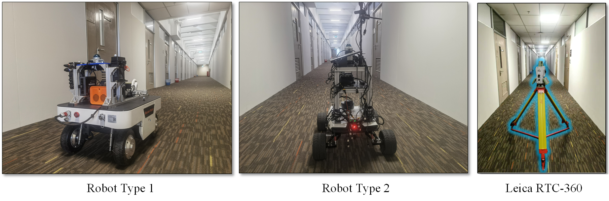

    

# [MNE-SLAM: Multi-agent Neural SLAM for Mobile Robots (Indoor Neural SLAM Dataset)](https://ins-dataset.github.io/ins/)

The dataset is collected over large-scale indoor areas, featuring:

* A comprehensive multi-sensor suite:
  + Non-repetitive lidar
  + RGB Camera
  + Depth Camera
  + High quality IMUs
* Multiple Robot Types
  

    
  

* High resolution large scale survey-grade prior maps
  

    
    
    
  

* Visualization of INS dataset.

    

# Notes:
Please click the [title](https://github.com/ins-dataset/ins) for the full dataset!

If you have some inquiry, please raise an [issue](https://github.com/ins-dataset/ins/issues) on github.

# Licence
This work is licensed under a [Creative Commons Attribution-NonCommercial-ShareAlike 4.0 International License](https://creativecommons.org/licenses/by-nc-sa/4.0/) and is intended for non-commercial academic use.

# Acknowledgement
We would like to thank our group’s previous work, "Robust Loop Closure by Textual Cues in Challenging Environments", for the support on the INS dataset. We gratefully acknowledge Thien-Minh Nguyen, Xinhang Xu, Yizhuo Yang, Jianping Li for their contributions.

# Updates

**15/11/2024**: Preliminary release.
**20/6/2025**: Fully release.
