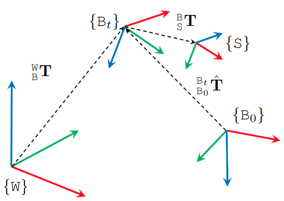

# User Manual

## Overview

Below are the ROS topics of each sensor modality in MCD. Please click on the link on each message type for their detailed definition. Other details such as resolutions are also provided. The naming convention `**/\<hardware-unit\>/\<modality\>/...**' is applied for all topics in both the ATV and HHS setups. Note that the 't' and 'b' affixes in the names of the realsense D455 modules refer to 'top' and 'bottom' units. They do not mean a hardware variant. 

<style type="text/css">
.tg  {border-collapse:collapse;border-spacing:0;}
.tg td{border-color:black;border-style:solid;border-width:1px;font-family:Arial, sans-serif;font-size:14px;
  overflow:hidden;padding:10px 5px;word-break:normal;}
.tg th{border-color:black;border-style:solid;border-width:1px;font-family:Arial, sans-serif;font-size:14px;
  font-weight:normal;overflow:hidden;padding:10px 5px;word-break:normal;}
.tg .tg-lboi{border-color:inherit;text-align:left;vertical-align:middle}
.tg .tg-9wq8{border-color:inherit;text-align:center;vertical-align:middle}
.tg .tg-a890{background-color:#FFF;border-color:inherit;color:#212529;text-align:left;vertical-align:middle}
.tg .tg-c3ow{border-color:inherit;text-align:center;vertical-align:top}
.tg .tg-uzvj{border-color:inherit;font-weight:bold;text-align:center;vertical-align:middle}
.tg .tg-0pky{border-color:inherit;text-align:left;vertical-align:top}
</style>
<table class="tg" align="center">
<colgroup>
<col style="width: 50.75px">
<col style="width: 200.75px">
<col style="width: 195.75px">
<col style="width: 223.75px">
<col style="width: 54.75px">
<col style="width: 300.75px">
</colgroup>
<thead>
  <tr>
    <th class="tg-uzvj" rowspan="1">Modality</th>
    <th class="tg-uzvj" rowspan="1">Hardware</th>
    <th class="tg-uzvj" colspan="1">ROS topics / Sensor suite</th>
    <th class="tg-uzvj" rowspan="1">Message type</th>
    <th class="tg-uzvj" rowspan="1">Rate<br>(Hz)</th>
    <th class="tg-9wq8" rowspan="1"><span style="font-weight:bold">Notes</span></th>
  </tr>
</thead>
<tbody>
  <tr>
    <td class="tg-uzvj" rowspan="2">Camera</td>
    <td class="tg-lboi"><a href="https://www.intelrealsense.com/depth-camera-d435i/" target="_blank" rel="noopener noreferrer">D435i</a></td>
    <td class="tg-lboi">/d435i/infra1/image_rect_raw<br><span style="font-weight:400;font-style:normal">/d435i/infra2/image</span>_<span style="font-weight:400;font-style:normal">rect</span>_raw</td>
    <td class="tg-lboi" rowspan="2"><a href="https://docs.ros.org/en/noetic/api/sensor_msgs/html/msg/Image.html" target="_blank" rel="noopener noreferrer">sensor_msgs/Image</a></td>
    <td class="tg-9wq8">30</td>
    <td class="tg-lboi">640×480 Greyscale<br><span style="font-weight:400;font-style:normal">640×480 Greyscale</span><br><span style="font-weight:400;font-style:normal">640×480 RGB</span></td>
  </tr>
  <tr>
    <td class="tg-lboi"><a href="https://www.intelrealsense.com/depth-camera-d455/" target="_blank" rel="noopener noreferrer">D455</a></td>
    <td class="tg-lboi">/d455b/infra1/image_rect_raw<br><span style="font-weight:400;font-style:normal">/d455b/infra2/image</span>_<span style="font-weight:400;font-style:normal">rect</span>_raw<br><span style="font-weight:400;font-style:normal">/d455b/color/image_raw</span></td>
    <td class="tg-9wq8">30</td>
    <td class="tg-lboi">640×480 Greyscale<br><span style="font-weight:400;font-style:normal">640×480 Greyscale</span><br><span style="font-weight:400;font-style:normal">640×480 RGB</span></td>
  </tr>
  <tr>
    <td class="tg-uzvj" rowspan="3">IMU</td>
    <td class="tg-lboi">D435i</td>
    <td class="tg-lboi">/d435i/imu</td>
    <td class="tg-9wq8">400</td>
    <td class="tg-a890"><a href="https://www.intelrealsense.com/how-to-getting-imu-data-from-d435i-and-t265/" target="_blank" rel="noopener noreferrer">Bosch BMI055</a></td>
  </tr>

  <tr>
    <td class="tg-lboi">D455b</td>
    <td class="tg-lboi">/d455b/imu</td>
    <td class="tg-lboi">/d455b/imu</td>
    <td class="tg-9wq8">400</td>
    <td class="tg-lboi"><a href="https://www.intelrealsense.com/wp-content/uploads/2020/06/Intel-RealSense-D400-Series-Datasheet-June-2020.pdf" target="_blank" rel="noopener noreferrer">See datasheet</a></td>
  </tr>
      <tr>
    <td class="tg-lboi">Livox Mid 360</td>
    <td class="tg-lboi">/livox/lidar/imu</td>
    <td class="tg-9wq8">400</td>
    <td class="tg-lboi">See datasheet</a></td>
  </tr>

  <tr>
    <td class="tg-uzvj" rowspan="1">Lidar</td>
    <td class="tg-lboi">Livox Mid70</td>
    <td class="tg-lboi">/livox/lidar</td>
    <td class="tg-lboi">/livox/lidar</td>
    <td class="tg-lboi"><a href="https://github.com/Livox-SDK/livox_ros_driver/blob/master/livox_ros_driver/msg/CustomMsg.msg" target="_blank" rel="noopener noreferrer">livox_ros_driver/CustomMsg</a></td>
    <td class="tg-9wq8">10</td>
    <td class="tg-lboi">1 channel.<br>Points per channel: 9984<br>Point format: see <a href="https://mcdviral.github.io/UserManual.html#point-format" target="_blank" rel="noopener noreferrer">our manual</a></td>
  </tr>
</tbody>
</table>


## Lidar data

### Resolution and rate

In all sequences, the mid70 Livox lidar have one single non-repetitive line with 9984 points per line. All lidars output data at 10 Hz.

### Point format

**For livox lidar**, the point has a custom structure that is defined by the manufacturer as follows:

```
# Livox costum pointcloud format.

uint32 offset_time      # offset time relative to the base time
float32 x               # X axis, unit:m
float32 y               # Y axis, unit:m
float32 z               # Z axis, unit:m
uint8 reflectivity      # reflectivity, 0~255
uint8 tag               # livox tag
uint8 line              # laser number in lidar
```

Please follows the instructions [here](https://github.com/Livox-SDK/livox_ros_driver) to install the livox driver, after which you should be able to import and manipulate the livox message in ROS python or C++ program.


### Time stamp
For MCD, please take note of the following:

* For the ouster data, the timestamp in the message header corresponds to the *end* of the 0.1s sweep. Let us denote it as $$t_h$$. Each lidar point has a timestamp (in nanosecond) that is relative to the *start* of the sweep, denoted as $$t_r$$. The absolute time of the point $$t_a$$ is therefore:

$$
t_{a} = t_{h} - 0.1 + t_{r}/\mathrm{1.0e9}
$$

* For the livox data, the timestamp in the message header corresponds to the *start* of the 0.1s sweep. We us denote it as $$t_h$$. Each lidar point has a timestamp (in nanosecond) that is relative to the *start* of the sweep, denoted asc $$t_r$$. The absolute time of the point $$t_a$$ is therefore:

$$
t_{a} = t_{h} + t_{r}/\mathrm{1.0e9}
$$

## Coordinate systems

The main coordinate systems in MCD is defined as follows:
  
<p align="center">
  
</p>

First, the coordinate system of the [prior maps](Groundtruth#survey-grade-prior-map) is referred to as the *World* frame $$\mathtt{W}$$.
Then the *Body* frame $$\mathtt{B}$$ coincides with the VN100 IMU in the NTU sequences, and the VN200 in the KTH and TUHH sequences.
Each sensor has a *Sensor* frame $${\mathtt{S}}$$ attached to it.

The extrinsics of the sensors in MCD are declared as transformation matrices $${}^{\mathtt{B}}_{\mathtt{S}}\bf{T} = \begin{bmatrix} {}^{\mathtt{B}}_{\mathtt{S}}\mathrm{R} & {}^{\mathtt{B}}_{\mathtt{S}}\mathrm{t} \\ 0 &1\end{bmatrix} $$, where $${}^{\mathtt{B}}_{\mathtt{S}}\mathrm{R}$$ and $${}^{\mathtt{B}}_{\mathtt{S}}\mathrm{t}$$ are respectively the rotational and translational extrinsics.

Therefore if one observes a landmark $${}^{\mathtt{C}}\mathrm{f}$$ in the camera frame $$\mathtt{C}$$, its coordinate in the body frame $${}^{\mathtt{B}}\mathrm{f}$$ is calculated as:

$${}^{\mathtt{B}}\mathrm{f} = {}^{\mathtt{B}}_{\mathtt{C}}\mathrm{R} {}^{\mathtt{C}}\mathrm{f} + {}^{\mathtt{B}}_{\mathtt{C}}\mathrm{t}$$

The ground truth data in our csv files are the poses $$({}^{\mathtt{W}}_{\mathtt{B}_t}\mathrm{q}, {}^{\mathtt{W}}_{\mathtt{B}_t}\mathrm{p})$$, where $${}^{\mathtt{W}}_{\mathtt{B}_t}\mathrm{q}$$ and $${}^{\mathtt{W}}_{\mathtt{B}_t}\mathrm{p}$$ are the orientation (in quaternion) and position of the body frame at time t relative to the world frame.

In most cases, the SLAM estimate $${}^{\mathtt{B}_0}_{\mathtt{B}_t}\hat{\bf{T}}$$ is relative to the coordinate frame that coincides with the body frame at initial time. It is therefore neccessary to align the SLAM estimate with the groundtruth. The [evo package](https://github.com/MichaelGrupp/evo) is a popular tool for this task.

<!-- calculate the error of the pose estimates $${}^{\mathtt{B}}_{\mathtt{S}}\hat{\bf{T}}$$ -->